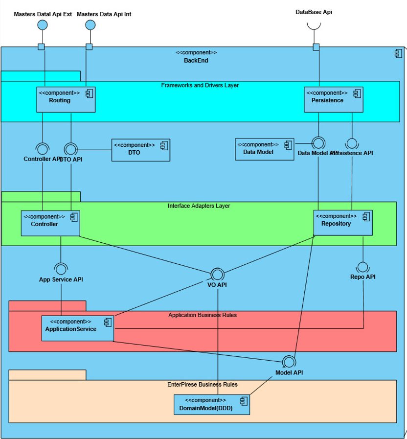

# Project Surgical Appointment and Resource Management System

## 1. Team Assignment

### 1.1. Sprint 1
| Team Member Name   | Team Member Number       | User Stories Assigned |
|------------------  |--------------------------|-----------------------|
| Rodrigo Cardoso    | 1221083                  | [5.1.3](Sprint_1/US_5.1.3/README.md) [5.1.4](Sprint_1/US_5.1.4/README.md) [5.1.5](Sprint_1/US_5.1.5/README.md) [5.1.8](Sprint_1/US_5.1.8/README.md) [5.1.9](Sprint_1/US_5.1.9/README.md) [5.1.10](Sprint_1/US_5.1.10/README.md) [5.1.11](Sprint_1/US_5.1.11/README.md)                      |
| Mário Ribeiro      | 1221019                  | [5.1.12](Sprint_1/US_5.1.12/README.md) [5.1.13](Sprint_1/US_5.1.13/README.md) [5.1.14](Sprint_1/US_5.1.14/README.md) [5.1.15](Sprint_1/US_5.1.15/README.md)                     |
| Miguel Oliveira    | 1211281                  | [5.1.1](Sprint_1/US_5.1.1/README.md) [5.1.20](Sprint_1/US_5.1.20/README.md) [5.1.21](Sprint_1/US_5.1.21/README.md) [5.1.22](Sprint_1/US_5.1.22/README.md) [5.1.23](Sprint_1/US_5.1.23/README.md)                      |
| Rodrigo Castro     | 1220636                  | [5.1.2](Sprint_1/US_5.1.2/README.md) [5.1.6](Sprint_1/US_5.1.6/README.md) [5.1.7](Sprint_1/US_5.1.7/README.md) [5.1.16](Sprint_1/US_5.1.16/README.md) [5.1.17](Sprint_1/US_5.1.17/README.md) [5.1.18](Sprint_1/US_5.1.18/README.md) [5.1.19](Sprint_1/US_5.1.19/README.md)                      |

### 1.2. Sprint 2
| Team Member Name   | Team Member Number       | User Stories Assigned |
|------------------  |--------------------------|-----------------------|
| Rodrigo Cardoso    | 1221083                  |                       |
| Mário Ribeiro      | 1221019                  |                       |
| Miguel Oliveira    | 1211281                  |                       |
| Rodrigo Castro     | 1220636                  |                       |

### 1.3. Sprint 3
| Team Member Name   | Team Member Number       | User Stories Assigned |
|------------------  |--------------------------|-----------------------|
| Rodrigo Cardoso    | 1221083                  |                       |
| Mário Ribeiro      | 1221019                  |                       |
| Miguel Oliveira    | 1211281                  |                       |
| Rodrigo Castro     | 1220636                  |                       |

## 2. Domain Model

### 2.1. Glossary
For more details, refer to the [Glossary](glossary.md).

## 3. Views of the application

### 3.2. Level 1

#### Logical View

### 3.3. Level 2

#### Logical View

#### Physical View

#### Implementation View

#### Mapping betweem Logical and Implmentation Views

#### Mapping between Implementation and Physical Views

### 3.4. Level 3

#### Masters Data

##### Logical View

##### Implementation View

#### SPA

##### Logical View

##### Implmentation View

