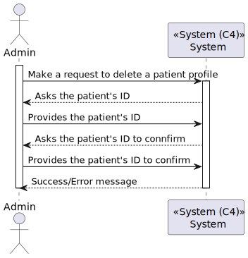
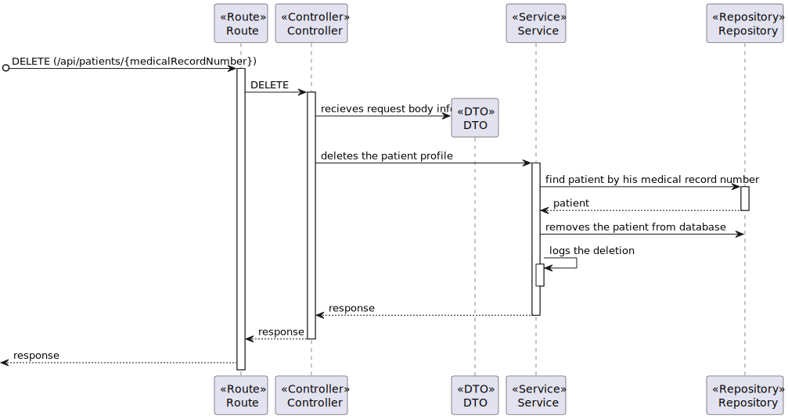

# US 5.1.10 - As an Admin, I want to delete a patient profile

## 1. Context

This US creates the functionality to delete a patient profile.

## 2. Requirements

**5.1.10** As an Admin, I want to delete a patient profile, so that I can remove patients who are no longer under care.

### 2.1. Acceptance Criteria

- Admins can search for a patient profile and mark it for deletion.
- Before deletion, the system prompts the admin to confirm the action.
- Once deleted, all patient data is permanently removed from the system within a predefined time frame.
- The system logs the deletion for audit and GDPR compliance purposes.

### 2.2. User Story Dependencies

**US 5.1.8** - The patient profile must be created on the system
**US 5.1.11** - The admin must select the patient by a type of data

## 3. Analysis

The admin can search for a patient profile to delete using one of the unique data in each patient (In our case, we are going to select for Medical Record Number, because is an "ID" in Hospital System).

Before deletion, the admin will enter his "ID" in request nody to delete the patient.

The patient data will be stored in a logger for audit, GDPR compilance purpose and for data analysis. After the period mandated, the patient data in logger (except the medical record number, the type of logger and modification date) will be removed.

### 3.1. Client-relevent questions

**Q:** What happens to patient data after the profile is deleted?

**P:** Patient data must be retained for a legally mandated period before being anonymized or deleted.

### 3.2. Domain Model references

N/A

## 4. Design - Process View

#### Level 1

#### Level 2

#### Level 3
