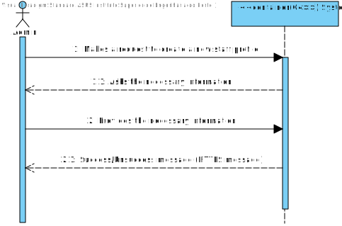
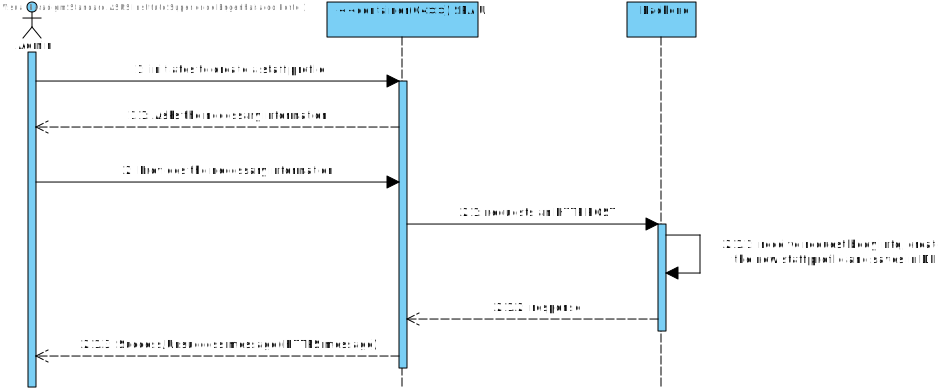

# US 5.1.12 - As an Admin, I want to create a new staff profile, so that I can add them to the hospital’s roster.

## 1. Analysis

#### Functional requirements

*Admins can create a staff profile by inputting details such as first name, last name, contact information(email and phone number),specialization, availability slots and licence number.
*The system processes the information and ensure´s the staff´s email and phone number are unique.
*A unique staff ID is generated upon profile creation.
*The profile is stored securely and access is based on role-based permissions.

#### Business rules

*The system must ensure that the staff´s email and phone number are unique.
*Staff IDs are unique and not role-specific (e.g., a doctor and nurse can share the same ID format).
*Staff id are unique and generated by the system. License numbers are unique but are not generated by the system.
*Staff id follow the format "(N | D | O)yyyynnnnn"
for instance, N202401234
N is for nurse, D is for doctor, O is for other.
yyyy is the year of recruitment
nnnnn is a sequential number.

License numbers are the numbers assigned by the professional guild (ex., "ordem dos enfermeiros", "ordem dos médicos") to the doctor or nurse attesting they legally can perform the medical acts of their profession.
*A staff member can only have one specialization.

#### Interested parts

*The interested parts in this US are the admin and staff members.

#### Preconditions

*Only the admin can create a staff profile.
*Admin must be logged in.

#### Postconditions

*A unique staff ID is generated upon profile creation.
*The profile is stored securely and access is based on role-based permissions.

#### User Story Dependencies

N/A

## Domain model apperance

## Level 1 - Process view:

# Design

 ## Level 2 - Process view
 

 ##  Applied Patterns

*GRASP Pattern (General Responsibility Assignment Software Patterns), used in the creation of controllers to assign the responsibility of handling system events to a class that is not part of the user interface (UI);

*CRUD Pattern (acronym for Create, Read, Update, and Delete) represents the four basic operations used in relational databases provided to system users, as well as in many HTTP services;

*SOLID Pattern (acronym for Single Responsibility Principle, Open-Closed Principle, Liskov Substitution Principle, Interface Segregation Principle, Dependency Inversion Principle), a set of principles that apply to any object-oriented design and serve as the central philosophy for methodologies like adaptive software development;

*DTO Pattern (Data Transfer Objects), for creating simple data structures that do not contain business logic.

# Implementation

 ## Level 3 -Process view
 

# Observations
 