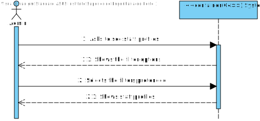
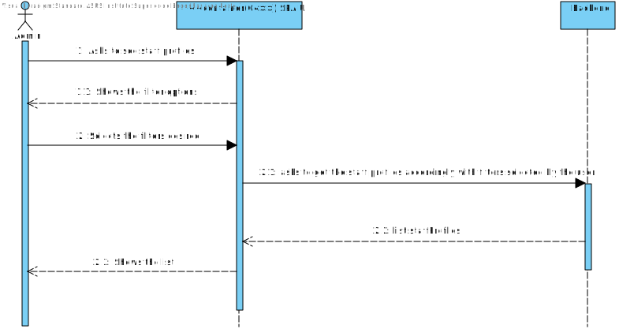

# US 5.1.15 - As an Admin, I want to list/search staff profiles, so that I can see the details, edit, and remove staff profiles.

## 1. Analysis

#### Functional requirements

*Admins can search staff profiles by attributes such as name, email, or specialization.
*The system displays search results in a list view with key staff information (name, email,
specialization).
*Admins can select a profile from the list to view, edit, or deactivate.
*The search results are paginated, and filters are available for refining the search results.

#### Business rules

*Admin should be able to search staff profiles by attributes such as name, email, or specialization.
*Admins should be able to select a profile from their search to view, edit, or deactivate.
*The search results must be paginated if needed.

#### Interested parts

*The interested parts in this US are the admin and staff members.

#### Preconditions

*Only the admin can list/search staff profiles.
*Admin must be logged in.

#### Postconditions

N/A

#### User Story Dependencies

*The user story has dependencie with US 5.1.12 because to list a staff member's profile, a staff member's profile must already exist.
*The user story has dependencie with US 5.1.13 because if he chooses to edit a staff member's profile there must be a funcionality that allows the him to do it.
**The user story has dependencie with US 5.1.14 because if he chooses to deactivate a staff member's profile there must be a funcionality that allows the him to do it.

## Domain model apperance

## Level 1 - Process view:

# Design

 ## Level 2 - Process view
 

 ##  Applied Patterns

*GRASP Pattern (General Responsibility Assignment Software Patterns), used in the creation of controllers to assign the responsibility of handling system events to a class that is not part of the user interface (UI);

*CRUD Pattern (acronym for Create, Read, Update, and Delete) represents the four basic operations used in relational databases provided to system users, as well as in many HTTP services;

*SOLID Pattern (acronym for Single Responsibility Principle, Open-Closed Principle, Liskov Substitution Principle, Interface Segregation Principle, Dependency Inversion Principle), a set of principles that apply to any object-oriented design and serve as the central philosophy for methodologies like adaptive software development;

*DTO Pattern (Data Transfer Objects), for creating simple data structures that do not contain business logic.

# Implementation

 ## Level 3 -Process view
 

# Observations
 