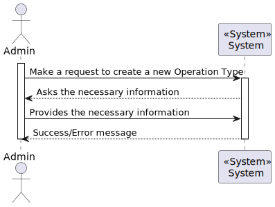
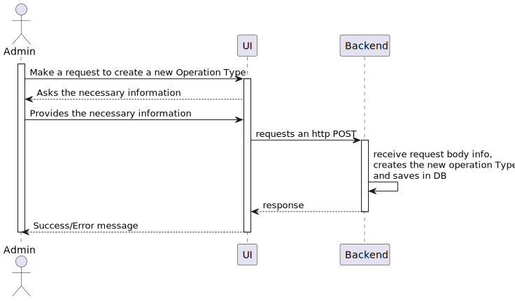
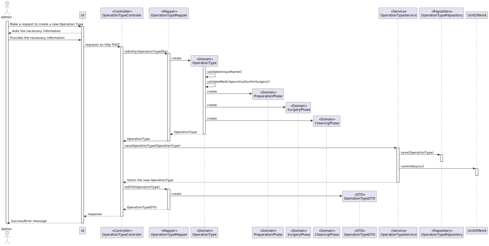

# US5.1.20 As an Admin, I want to add new types of operations, so that I can reflect the available medical procedures in the system.

## 1. Analysis

### Functional Requirements

The goal of this User Story (US) is to allow the system administrator to add new types of surgical operations. This ensures that the system maintains an updated and accurate list of available medical procedures.

### Business Rules

* **Unique Name:** Each operation type must have a unique name, regardless of whether it is active or inactive.

* **Deactivation:** Deactivating an operation type makes it unavailable for new operations but preserves historical data.

* **Three Phases:** Each operation type must have the following phases with their respective durations:
  * Anesthesia/Patient Preparation
  * Surgery
  * Cleaning

### Stakeholders

* **Administrator:** Manages the list of available operations.
* **Doctors:** Request operations based on their specialization.
* **Patients:** Rely on surgical procedures for treatment.
* **Scheduling Module:** Uses this information to schedule surgeries.

### Preconditions

* The administrator must be authenticated in the system.
* The new operation type name must not already exist in the system.

### Postconditions

* The new operation type is added to the system and is available for future surgeries, as long as it is active.
* Historical data is preserved if the operation type is deactivated.

 

## 2. Design

### Patterns Applied

* **GRASP (General Responsibility Assignment Software Patterns):** Used to assign responsibility to controllers for handling system events, separating them from the UI.
* **CRUD Pattern:** Create, Read, Update, and Delete operations are applied to the database for operation types.
* **SOLID Principles:** These design principles (Single Responsibility, Open-Closed, Liskov Substitution, Interface Segregation, Dependency Inversion) are the foundation of object-oriented software design.
* **DTO (Data Transfer Object):** Used to create simple data structures that do not contain business logic.

 

## 3. Implementation

### High-Level Process View (L1)

### Detailed Process View (L2)

### Domain Model

### Code Examples (L3)

 

## 4. Testing

### 1. Business Rule Tests

#### 1.1. Unique Name Validation Test
- **Description:** Test if the system prevents adding a new operation type when its name already exists.
- **Scenario:** Attempt to add an operation type with a name that is already used (both active and inactive).
- **Expected Result:** The system should reject the request and display an error message.

#### 1.2. Deactivation Behavior Test
- **Description:** Test if deactivated operation types cannot be selected for new surgeries while preserving historical data.
- **Scenario:** Deactivate an operation type and try scheduling a new surgery with it.
- **Expected Result:** The system should not allow the deactivated operation to be selected for new surgeries.

#### 1.3. Phase Duration Validation Test
- **Description:** Ensure the system correctly stores and displays the three phases (Anesthesia/Preparation, Surgery, Cleaning) with their durations.
- **Scenario:** Add an operation type and assign specific durations to each phase.
- **Expected Result:** The system should save and display the correct durations.

---

### 2. CRUD Tests

#### 2.1. Create Operation Type Test
- **Description:** Test if a new operation type can be successfully created with valid inputs.
- **Scenario:** Add a new operation type with a unique name and phase durations.
- **Expected Result:** The new operation type should be saved and available for future surgeries.

---

### 3. Security and Access Control Tests

#### 3.1. Admin Authentication Test
- **Description:** Ensure that only authenticated administrators can add new operation types.
- **Scenario:** Attempt to add a new operation type without admin authentication or as a non-admin user.
- **Expected Result:** The system should deny access and prompt for admin credentials.

---

### 4. Integration Tests

#### 4.1. Integration with Scheduling Module
- **Description:** Test if the new operation type integrates correctly with the scheduling module and can be selected for surgery schedules.
- **Scenario:** Add a new operation type and schedule a surgery using it.
- **Expected Result:** The new operation type should be selectable and usable in the scheduling module.

---

### 6. Error Handling and Feedback Tests

#### 6.1. Error Messages Test
- **Description:** Ensure the system provides clear error messages for invalid inputs (e.g., duplicate name, missing phase durations).
- **Scenario:** Submit a form with missing or invalid fields.
- **Expected Result:** The system should display appropriate error messages for each invalid input.

## Observations

This user story implementation will follow the MVC architecture, ensuring separation of concerns between the view, model, and controller layers. The operation types will be managed using a database, and the system will provide an interface for administrators to add new procedures, ensuring compliance with the described business rules.
