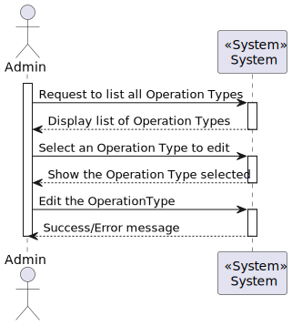
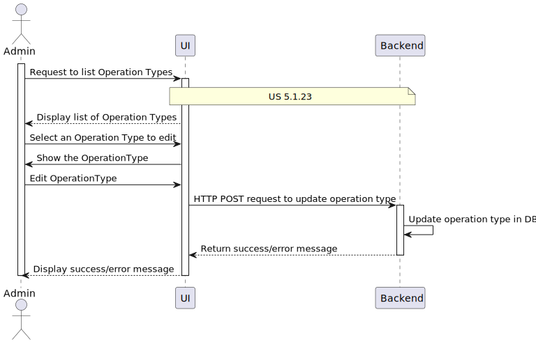
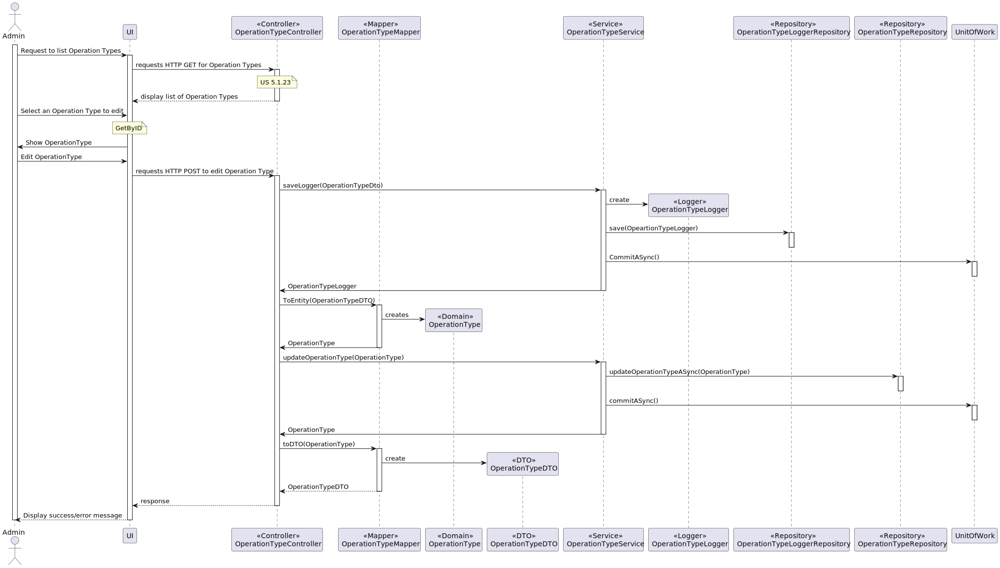

# US5.1.21 As an Admin, I want to edit existing operation types, so that I can update or correct information about the procedure.

## 1. Analysis

### Functional Requirements

The goal of this User Story is to allow administrators to update the information of existing surgical operation types. This ensures the system reflects the most accurate and up-to-date details regarding medical procedures.

### Business Rules

* **Editable Fields:** The administrator can modify:
  - **Operation Name** (must remain unique).
  - **Required Staff by Specialization.**
  - **Estimated Duration** (includes individual phase durations for Anesthesia/Preparation, Surgery, and Cleaning).
  
* **Historical Data:** Previous operation records maintain the original information, but any new surgical requests use the updated data.

* **Immediate Reflection:** Once the operation type is updated, the changes are immediately reflected in the system for future scheduling.

### Given Information to be Processed for Business Needs

The client has indicated that the system should allow modification of existing operation types without affecting historical records. The following information needs to be processed when editing:

- **ID:** Unique identifier for the operation type.
- **Name:** Ensure the updated name remains unique.
- **Staff Specialization:** Update the list of required medical staff for the procedure.
- **Estimated Duration:** Update the total estimated time for the operation, including the specific phases.

### Stakeholders

* **Administrator:** Updates operation types in the system.
* **Doctors:** Access updated procedure details for surgery requests.
* **Patients:** Receive treatments based on the latest medical procedures.
* **Scheduling Module:** Uses the updated information for planning surgeries.

### Preconditions

* The administrator must be authenticated.
* The operation type must exist in the system.
* The updated operation name must remain unique.

### Postconditions

* The system reflects the updated operation type for future surgeries.
* Historical data remains unchanged, while new surgery requests use the updated information.

 

## 2. Design

### Domain Model
 

### High-Level Process View (L1)

### Detailed Process View (L2)

### Code Examples (L3)

### Patterns Applied

* **GRASP (General Responsibility Assignment Software Patterns):** Used for the assignment of responsibilities to controllers for handling system events.
* **CRUD Pattern:** The operation types are managed using basic Create, Read, Update, and Delete functionality in the database.
* **SOLID Principles:** Object-oriented design is governed by Single Responsibility, Open-Closed, Liskov Substitution, Interface Segregation, and Dependency Inversion principles.
* **DTO (Data Transfer Object):** Simple data structures are used to transmit data between system layers without business logic.

 

## 3. Implementation

### Implementation Steps

1. **Database Schema Update:**
  There is no need to change the `operation_types` table from the previous User Story. The existing structure already supports the required fields (`name`, `required_staff`, `estimated_duration`). Ensure historical data is preserved by creating a versioning mechanism or a history table.

2. **Backend Development:**
  - Enhance `OperationTypeService` to handle updates while preserving historical data.
  - Extend `OperationTypeController` to include endpoints for updating operation types.

3. **API Endpoints:**
  - `PUT /operation-types/{id}`: Endpoint to update an existing operation type.
  - `GET /operation-types/{id}`: Endpoint to retrieve details of a specific operation type.

4. **Validation Logic:**
  - Ensure the backend validates the uniqueness of the operation type name during updates.
  - Validate that all required fields are provided and correctly formatted.

## 4. Testing

### 1. Business Rule Tests

#### 1.1. Unique Name Validation Test
- **Description:** Test if the system prevents updating an operation type's name to one that already exists.
- **Scenario:** Attempt to update the name of an existing operation type to a name already in use.
- **Expected Result:** The system should reject the update and display an error message.

#### 1.2. Immediate Reflection of Changes Test
- **Description:** Test if the updated operation type details are reflected immediately in new surgery requests.
- **Scenario:** Update an operation type and try scheduling a new surgery.
- **Expected Result:** The updated information should be used for the new surgery.

#### 1.3. Historical Data Preservation Test
- **Description:** Ensure historical operation records preserve the original data after updates to an operation type.
- **Scenario:** Update an operation type and check historical records.
- **Expected Result:** Historical data should remain unchanged.

---

### 2. CRUD Tests

#### 2.1. Edit Operation Type Test
- **Description:** Test if the administrator can successfully edit an operation type with valid inputs.
- **Scenario:** Search for and update the fields of an operation type.
- **Expected Result:** The system should save and reflect the updated information.

---

### 3. Security and Access Control Tests

#### 3.1. Admin Authentication Test
- **Description:** Ensure that only authenticated administrators can edit operation types.
- **Scenario:** Attempt to edit an operation type without proper admin authentication.
- **Expected Result:** The system should deny access and prompt for admin credentials.

---

### 4. Integration Tests

#### 4.1. Integration with Scheduling Module
- **Description:** Test if the updated operation type integrates correctly with the scheduling module and can be selected for new surgeries.
- **Scenario:** Update an operation type and schedule a surgery using it.
- **Expected Result:** The updated operation type should be selectable and usable in the scheduling module.

---

### 6. Error Handling and Feedback Tests

#### 6.1. Error Messages Test
- **Description:** Ensure the system provides clear error messages for invalid inputs (e.g., duplicate name, missing required fields).
- **Scenario:** Submit the edit form with missing or invalid inputs.
- **Expected Result:** The system should display appropriate error messages for each invalid input.

 

## Observations

