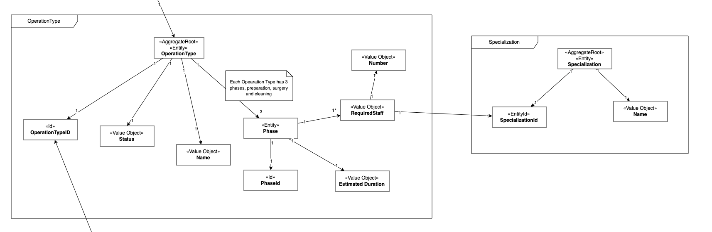
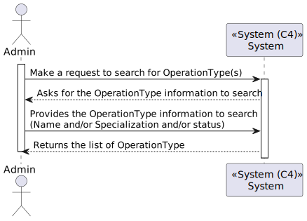
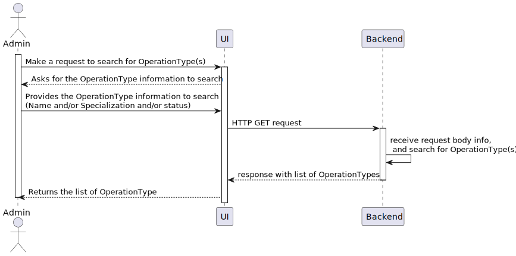
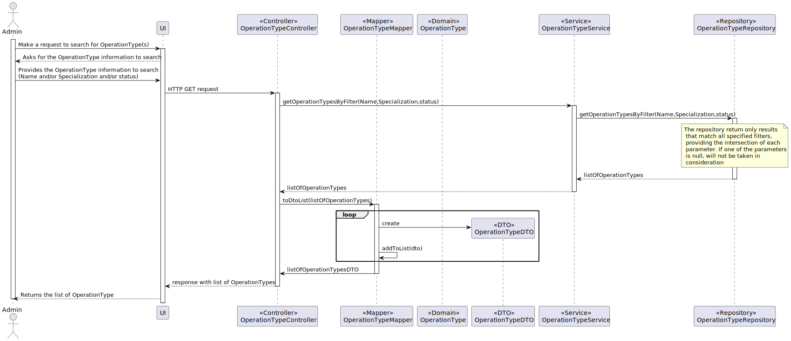

# US5.1.23 As an Admin, I want to list and search operation types so that I can see the details, edit, and remove operation types.

## 1. Analysis

### Functional Requirements

The purpose of this User Story (US) is to allow administrators to view a list of operation types, search and filter them, and manage their details (e.g., name, required staff, estimated duration).

### Business Rules

- **Search Criteria:** Administrators can search for operation types by:
  * **Name** (exact or partial matches)
  * **Specialization** (relevant field of medicine, e.g., cardiology)
  * **Status** (active or inactive)

### Given Information to be Processed for Business Needs

The following attributes should be displayed and managed in the system for each operation type:
- **Name:** The name of the operation type (e.g., Appendectomy).
- **Required Staff by Specialization:** List of necessary staff categorized by medical specialty (e.g., surgeon, anesthesiologist).
- **Estimated Duration:** The projected time for the procedure, which can include sub-segments like preparation, surgery, and cleanup phases.
- **Status:** Operational status of the type (active or inactive).

### Stakeholders

* **Administrator:** Manages the list of available operation types.
* **Doctors:** Request procedures based on their field of specialization.
* **Scheduling Module:** Requires details on operation types for scheduling.

### Preconditions

* The administrator must be authenticated in the system.
* The operation type list is pre-populated in the database.

### Postconditions

* The operation type list is accessible, searchable, and editable.
* Changes to an operation type are reflected immediately in the system.

---

## 2. Design

### Domain Model

### High-Level Process View (L1)

### Detailed Process View (L2)

### Code Examples (L3)

### Patterns Applied

* **GRASP (General Responsibility Assignment Software Patterns):** Responsibility is assigned to controllers for handling list and search functionalities.
* **CRUD Pattern:** CRUD operations are enabled for viewing, editing, and deactivating operation types.
* **DTO (Data Transfer Object):** Used to transfer data between backend and frontend, ensuring separation of business logic and UI representation.

---

## 3. Implementation

---

## 4. Testing

### 1. Functional Tests

#### 1.1. List Operation Types Test
- **Description:** Test if the system displays the operation type list.
- **Scenario:** Admin accesses the operation types page.
- **Expected Result:** All operation types are displayed.

#### 1.2. Search by Name Test
- **Description:** Verify the search functionality for operation types by name.
- **Scenario:** Admin enters a name or partial name in the search field.
- **Expected Result:** Only operation types matching the input are displayed.

#### 1.3. Filter by Status Test
- **Description:** Verify the filter functionality for operation types by active/inactive status.
- **Scenario:** Admin selects "inactive" filter.
- **Expected Result:** Only inactive operation types are displayed.

---

### 2. Security and Access Control Tests

#### 2.1. Admin Authentication Test
- **Description:** Ensure that only authenticated administrators can view and manage operation types.
- **Scenario:** Access the operation types page without admin credentials.
- **Expected Result:** The system denies access.

---

### 3. Integration Tests

#### 3.1. Integration with Scheduling Module
- **Description:** Test if operation types updated in the list integrate with the scheduling module.
- **Scenario:** Update an operation type and attempt to use it in scheduling.
- **Expected Result:** The scheduling module reflects the updated operation type.

---

### 4. Error Handling and Feedback Tests

#### 4.1. Clear Feedback for No Results
- **Description:** Ensure the system provides feedback when no operation types match search criteria.
- **Scenario:** Apply search filters that return no results.
- **Expected Result:** The system displays a “No operation types found” message.
