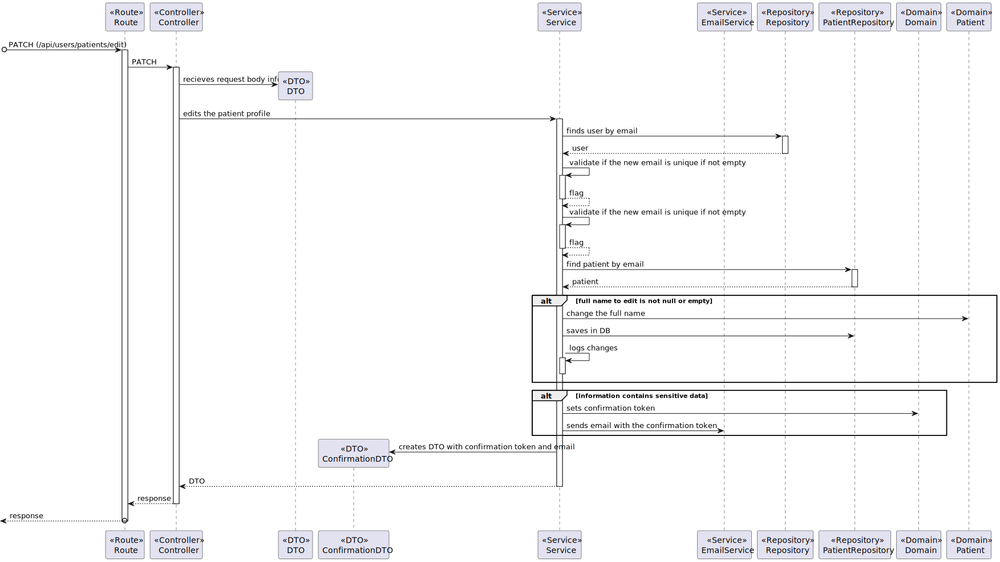
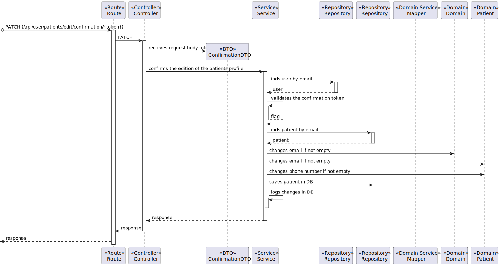

# US 5.1.4 - As a Patient, I want to update my user profile

## 1. Context

This US creates the functionality to patients update their profile

## 2. Requirements

**5.1.4** As a Patient, I want to update my user profile, so that I can change my personal details and preferences.

### 2.1. Acceptance Criteria

- Patients can log in and update their profile details (e.g., name, contact information, preferences).
- Changes to sensitive data, such as email, trigger an additional verification step (e.g., confirmation email).
- All profile updates are securely stored in the system.
- The system logs all changes made to the patient's profile for audit purposes.

### 2.2. User Story Dependencies

**US 5.1.3** - The patient must be registered on the system.
**US 5.1.7** - The patient must be logged on the system.

## 3. Analysis

The patient can only change the data if he is logged into the system (the system has provided a login token).

Editable fields are:
- Name
- Email
- Phone Number

In case of editing sensitive data, an email confirmation is sent to the patient. Then, the patient must click on confirm, and the changes of sensitive data are done.

### 3.1. Client-relevant questions

N/A

### 3.2. Domain model references

N/A

## 4. Design - Process View

 #### Level 1
 

 #### Level 2
 

 #### Level 3 - Prior Confirmation
 

 #### Level 3 - Posterior Confirmation
 