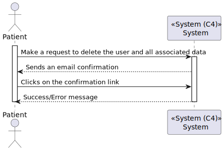
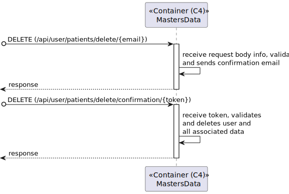
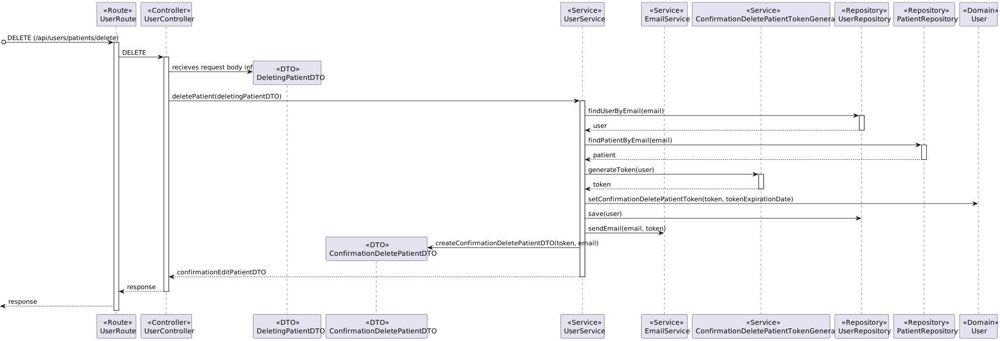
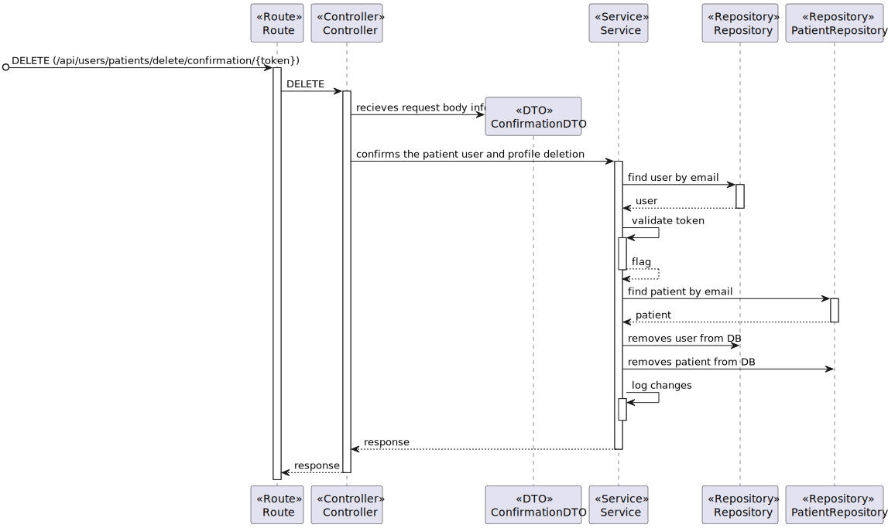

# US 5.1.4 - As a Patient, I want to delete my account and all associated data

## 1. Context

This US creates the functionality to patients update their profile

## 2. Requirements

**5.1.4** As a Patient, I want to delete my account and all associated data, so that I can exercise my right to be forgotten as per GDPR.

### 2.1. Acceptance Criteria

- Patients can request to delete their account through the profile settings.
- The system sends a confirmation email to the patient before proceeding with account deletion.
- Upon confirmation, all personal data is permanently deleted from the system within the legally required time frame (e.g., 30 days).
- Patients are notified once the deletion is complete, and the system logs the action for GDPR compliance.
- Some anonymized data may be retained for legal or research purposes, but all identifiable information is erased.

### 2.2. User Story Dependencies

**US 5.1.3** - The patient must be registered on the system.
**US 5.1.7** - The patient must be logged on the system.

## 3. Analysis

In profile settings, the patient can request to delete their account.

Before the deletion, the system should send a confirmation email to the patient.

When the patient clicks in confirmation, in 30 days all patient data must be deleted from the system.

Patient are notified by email when the deletion is complete.

The system logs the action of deletion.

### 3.1. Client-relevant questions

N/A

### 3.2. Domain model references

N/A

## 4. Design - Process View

 #### Level 1
 

 #### Level 2
 

 #### Level 3 - Prior Confirmation
 

 #### Level 3 - Posterior Confirmation
 