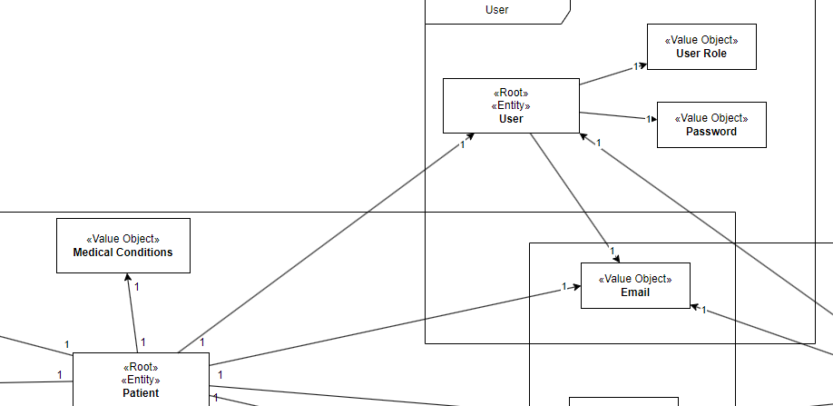
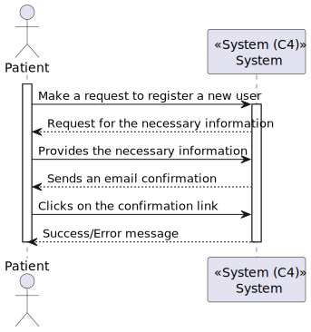
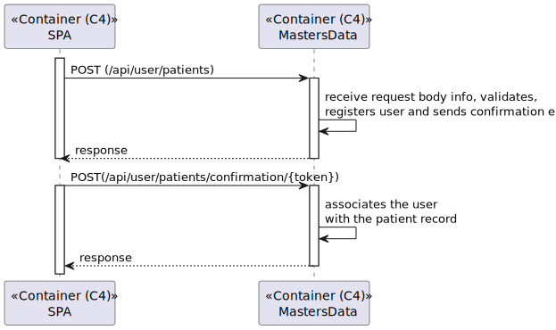
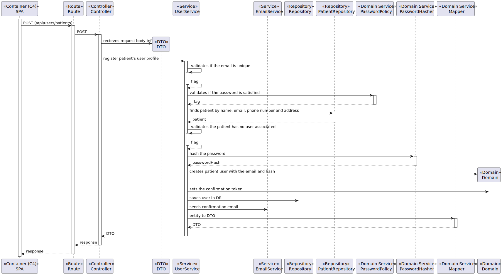
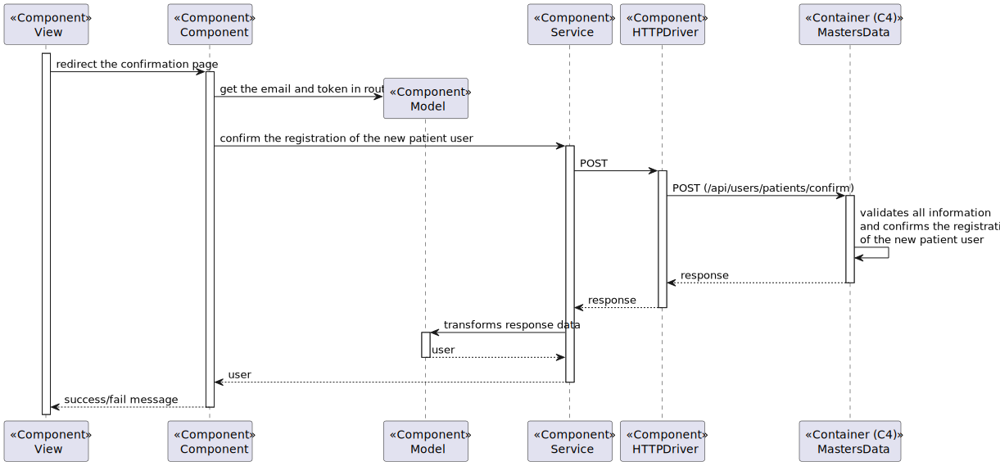

# US 6.2.1 - As a Patient, I want to register for the healthcare application

## 1. Context

This US creates the functionality to a patient register in healthcare application.

## 2. Requirements

**6.2.1** As a Patient, I want to register for the healthcare application, so that I can create a user profile and book appointments online.

### 2.1. Acceptance Criteria

- Patients can self-register using the external IAM system.
- During registration, patients provide personal details (e.g., name, email, phone) and create a profile.
- The system validates the email address by sending a verification email with a confirmation link.
- Patients cannot list their appointments without completing the registration process.

### 2.2. User Story Dependencies

**US 6.2.6** - The patient profile must be created on the system.

## 3. Analysis

The patient will register in the internal IAM system.

Durint the registration, patients provide the name, email and phone the same that the patient profile.

The patient will register the user in system and the system associate the user with the patient profile already created -> Creation of user profile.

Only one user has associated with the patient profile.

### 3.1. Client-related questions

**Q:** As a patient, do I need to have a profile created by the administrator?

**R:** Yes, you need to have a patient profile already created by the administrator. Patients cannot self-register unless they already exist in the hospital system.

**Q:** Can external identity management systems like Google or LinkedIn be used for patient authentication?

**R:** Yes, you can use external identity management systems like Google or LinkedIn. The system will need to match the credentials (email, phone number) with the patient’s record to complete the registration.

**Q:** n user story 5.1.3, there is an acceptance criterion that caused me some doubts: "The system validates the email address by sending a verification email with a confirmation link."

I understand the relevance of this acceptance criterion when not using an external IAM (Identity and Access Management) system. It ensures that users can't claim someone else's email address, as they would need to access the email to confirm their registration (for example, by clicking a unique link sent to the email).

However, there is another acceptance criterion stating: "Patients can self-register using the external IAM system." In this case, with an external IAM, wouldn't it be possible to bypass the step of sending a confirmation link to validate the email?

Would the following approach be considered correct?

An unauthenticated user tries to log in/access a patient area/register.
The unauthenticated user submits their credentials through the external IAM login (proving ownership of the email in the process).
The system receives this user's information (email), and if there is no corresponding user in the system, it asks for registration details (such as name and phone number).
The user submits the registration details, completing the registration as a patient in the system.
Advantages of this approach:

Improved user experience: It simplifies the registration process by reducing steps, making it quicker and more convenient for users.
Efficiency: By relying on the external IAM for email validation, you avoid duplicating validation mechanisms and streamline the process.
This approach ensures that the email belongs to the patient without the need to send a confirmation email. Do you think this is a good solution, even though it doesn't comply with one of the acceptance criteria?

NOTE: Google's IAM will be used for this process, which is reliable and also provides the email of the user who logged in (I don't know if this approach will be possible with other IAM system)

**R:** imagine the following scenario,
a patient is admitted to the hospital and a clerk registers their patient record with email abc@abc.com. that's the patient personal email.
afterwards, that same patient wants to self-register in the system.
the system use external IAM provider xyz
the patient will create an account in the IAM provider, e.g., abc12@xy2z.com and will use that identity to self-register as patient abc@abc.com
the system needs to send a verification email to abc@abc.com
when the patient follows the link sent to their personal email, the system will be able to "connect" the two emails as identifying the same person, and provide access to the system

### 3.2. Domain model references

## 4. Design - Process View

 #### Level 1
 

 #### Level 2
 

 #### Level 3 - Prior Confirmation
 

 #### Level 3 - Posterior Confirmation
 