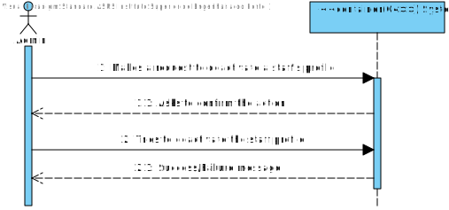
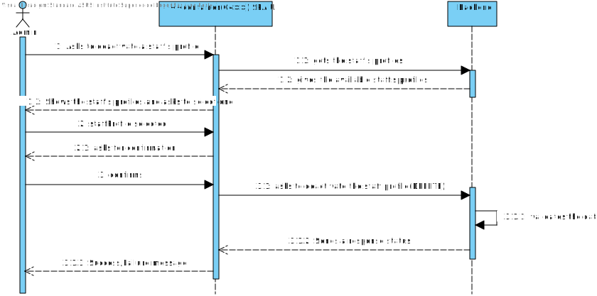
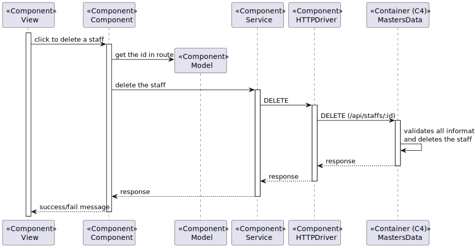

# US 6.2.12 - As an Admin, I want to deactivate a staff profile, so that I can remove them from the hospital’s active roster without losing their historical data.

## 1. Analysis

#### Functional requirements

*Admins can search for and select a staff profile to deactivate.
*Deactivating a staff profile removes them from the active roster, but their historical data (e.g.,
appointments) remains accessible.
*The system confirms deactivation and records the action for audit purposes.

#### Business rules

*Admin should be able to deactivate any staff member´s profile.
*Once a profile is deactivated his hiostorical data should remain accessible.
*System should record the deactivation for audit purposes.

#### Interested parts

*The interested parts in this US are the admin and staff members.

#### Preconditions

*Only the admin can deactivate a staff profile.
*Admin must be logged in.

#### Postconditions

*Deactivating a staff profile removes them from the active roster, but their historical data (e.g.,
appointments) remains accessible.
*The system confirms deactivation and records the action for audit purposes.

#### User Story Dependencies

*The user story has dependencie with US 5.1.12 because to deactivate a staff member's profile, a staff member's profile must already exist.

## Domain model apperance

## Level 1 - Process view:

# Design

 ## Level 2 - Process view
 

 ##  Applied Patterns

*GRASP Pattern (General Responsibility Assignment Software Patterns), used in the creation of controllers to assign the responsibility of handling system events to a class that is not part of the user interface (UI);

*CRUD Pattern (acronym for Create, Read, Update, and Delete) represents the four basic operations used in relational databases provided to system users, as well as in many HTTP services;

*SOLID Pattern (acronym for Single Responsibility Principle, Open-Closed Principle, Liskov Substitution Principle, Interface Segregation Principle, Dependency Inversion Principle), a set of principles that apply to any object-oriented design and serve as the central philosophy for methodologies like adaptive software development;

*DTO Pattern (Data Transfer Objects), for creating simple data structures that do not contain business logic.

# Implementation

 ## Level 3 -Process view
 

# Observations
 