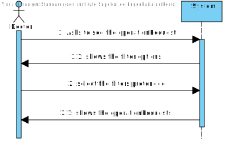
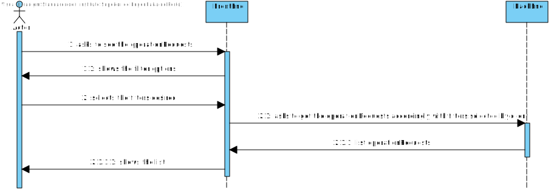
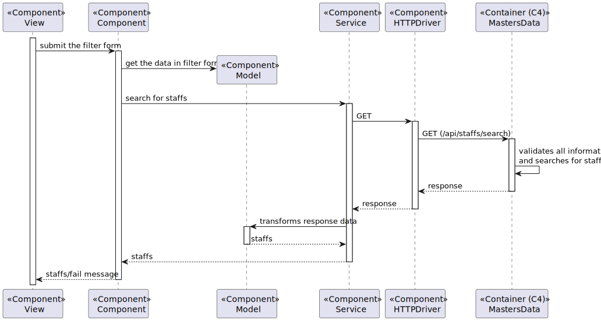

# US 6.2.17 - As a Doctor, I want to list/search operation requisitions, so that I see the details,edit, and remove operation requisitions

# 1. Análise

#### Requisitos funcionais

*The system displays a list of operation requests in a searchable and filterable view.
*Each entry in the list includes operation request details (e.g., patient name, operation type, status).
*Doctors can select an operation request to view, update, or delete it.

#### Regras de negócio

*Doctor can see the operation requests they have submitted as well as the operation requests of a certain patient.
*Doctor can search and filter by operation type, patient name, patient medical record number, date range

#### Partes interessadas

*The interested parts in this US are the doctor.

#### Pré-condições

*Doctor must be logged in.
 
#### Pós-condições

## Nível 1 - Vista Processo:

# 2. Design

## Nível 2 - Vista Processo:

##  Padrões Aplicados

* Padrão GRASP (General Responsibility Assignment Software Patterns), utilizado na criação de controladores para atribuir a responsabilidade de manipular eventos do sistema para uma classe que não seja de interface do usuário (UI);

* Padrão CRUD (acrónimo do inglês Create, Read, Update and Delete) são as quatro operações básicas utilizadas em bases de dados relacionais fornecidas aos utilizadores do sistema, assim como em muitos serviços HTTP.

* Padrão SOLID (acrónimo do inglês Single Responsibility Principle, Open-Closed Principle, Liskov Substitution Principle, Interface Segregation Principle, Dependency Inversion Principle), princípios que se aplicam a qualquer design orientado a objetos, são a filosofia central para metodologias como desenvolvimento software adaptável.

* Padrão DTO (Data Transfer Objects), na criação de estruturas de dados simples que não contêm lógica de negócios.

# Implementação

# Observações