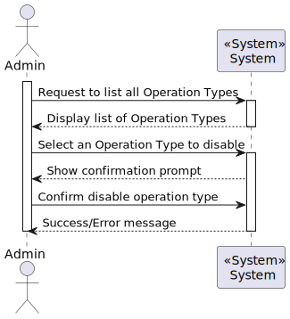
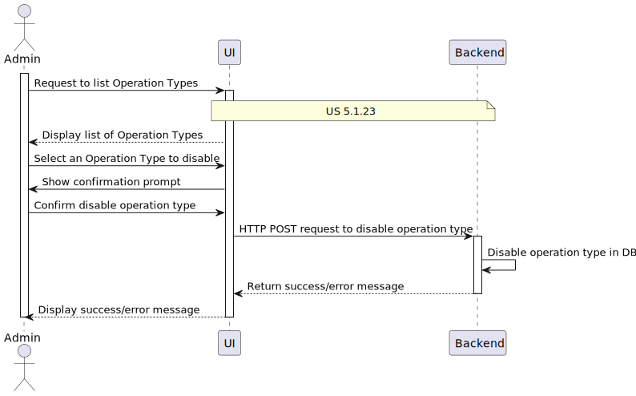
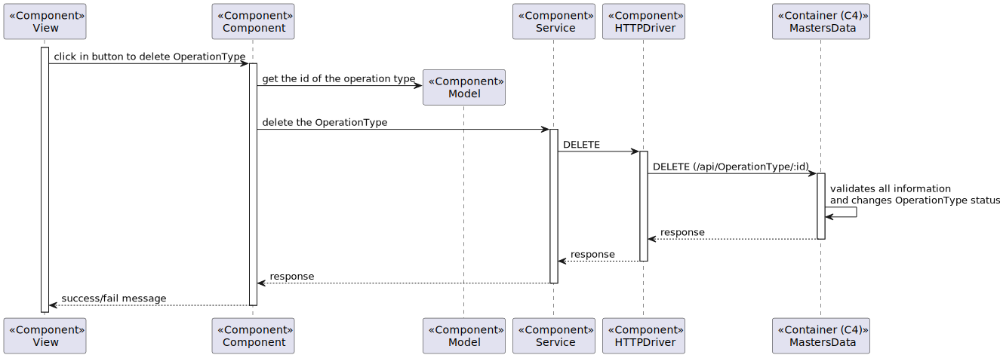

# US5.1.22 - Remove Obsolete or No Longer Performed Operation Types

## 1. Analysis

### Functional Requirements

The goal of this User Story (US) is to allow the system administrator to remove obsolete or no longer performed operation types by marking them as inactive. This ensures that the system remains up-to-date with current hospital practices while preserving historical data.

### Business Rules

* **Inactive Types:** Inactive operation types should no longer be available for future scheduling but must remain in the system for historical purposes.
* **Confirmation Prompt:** Before deactivating an operation type, the system must display a confirmation prompt to avoid accidental changes.
* **Search Capability:** Administrators should be able to search for operation types by name or status (active/inactive) to manage them easily.

* **Future Consideration:** Reactivating a previously deactivated operation type is not required at this stage, but it may become a requirement in the future.

### Information to be Processed

The administrator interacts with the following data regarding the operation types to mark them as inactive:

- **ID:** Unique identifier for each operation type.
- **Status:** The active or inactive status of the operation type.

### Stakeholders

- **Administrator:** Manages the list of available operations and keeps the system updated.
- **Doctors:** Ensure that obsolete procedures are not available for scheduling.
- **Patients:** Rely on accurate and current surgical operations for treatment.
- **Scheduling Module:** Uses this information to display only active operation types for future scheduling.

### Preconditions

- The administrator must be authenticated in the system.
- The operation type to be deactivated must exist in the system, and need to be activated.

### Postconditions

- The selected operation type is marked as inactive and is no longer available for scheduling.
- Historical data regarding surgeries performed using this operation type is preserved.

## 2. Design

### Domain Model

### High-Level Process View (L1)

### Detailed Process View (L2)

### Code Examples (L3)

### Patterns Applied

- **GRASP (General Responsibility Assignment Software Patterns):** Assigns responsibility to controllers for handling the events related to marking an operation type as inactive.
- **CRUD Pattern:** The status change of the operation type is an "Update" operation in the database.
- **DTO (Data Transfer Object):** The operation type data is transferred between the frontend and backend as a DTO to separate business logic from the data structure.
- **MVC Architecture:** Ensures separation of concerns between the view, model, and controller layers.

## 3. Implementation

1. **Database Schema Update:**
  - No changes are required to the `operation_types` table. The existing structure supports the necessary fields (`ID`, `status`). Ensure historical data is preserved by implementing a versioning mechanism or a history table.

2. **Backend Development:**
  - Update the `OperationType` model to include the method to change `status`.
  - Enhance `OperationTypeService` to handle status updates while preserving historical data.
  - Extend `OperationTypeController` to include endpoints for updating the status of operation types.

3. **API Endpoints:**
  - `PUT /operation-types/{id}/status`: Endpoint to update the status of an existing operation type.
  - `GET /operation-types`: Endpoint to retrieve a list of all operation types with their statuses.

4. **Validation Logic:**
  - Ensure the backend validates the status change request.
  - Validate that the operation type exists before attempting to update its status.
  - Ensure that the status field is correctly formatted and within the allowed values (e.g., active, inactive).

## 4. Testing

### 1. Business Rule Tests

#### 1.2. Deactivation Behavior Test
- **Description:** Ensure that deactivated operation types are not available for future scheduling but remain in historical records.
- **Scenario:** Deactivate an operation type and attempt to schedule a new surgery with it.
- **Expected Result:** The system should prevent the operation type from being selected for new surgeries but keep it in historical data.

---

### 2. CRUD Tests

#### 2.1. Update Operation Type Status Test
- **Description:** Test if the status of an operation type can be successfully updated from active to inactive.
- **Scenario:** Mark an operation type as inactive in the system.
- **Expected Result:** The operation type’s status should change to inactive and be reflected in the system.

---

### 3. Security and Access Control Tests

#### 3.1. Admin Authentication Test
- **Description:** Ensure that only authenticated administrators can deactivate operation types.
- **Scenario:** Attempt to deactivate an operation type without admin authentication.
- **Expected Result:** The system should deny access and require admin credentials.

---

### 4. Integration Tests

#### 4.1. Integration with Scheduling Module
- **Description:** Test if deactivated operation types are no longer available for scheduling.
- **Scenario:** Mark an operation type as inactive and attempt to schedule a surgery using it.
- **Expected Result:** The deactivated operation type should not be selectable for scheduling, while existing historical records should be preserved.

---

### 6. Error Handling and Feedback Tests

#### 6.1. Error Messages Test
- **Description:** Ensure the system provides clear error messages when an invalid operation is attempted (e.g., trying to deactivate a non-existing operation type).
- **Scenario:** Attempt to deactivate a non-existing operation type or bypass the confirmation prompt.
- **Expected Result:** The system should display appropriate error messages for the invalid operation.

---

## Observations

This user story will follow the MVC architecture, ensuring separation of concerns between the user interface and business logic. Administrators will be provided with a straightforward interface to mark operation types as inactive, thus keeping the system updated with current hospital practices.

