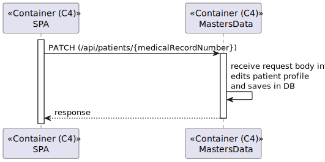
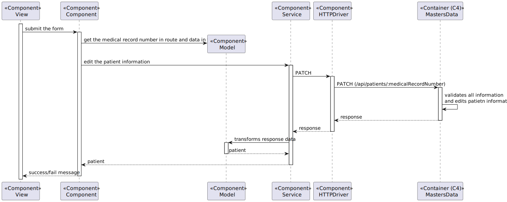

# US 6.2.7 - As an Admin, I want to create a new patient profile

## 1. Context

This US creates the functionality to edit a patient profile.

## 2. Requirements

**6.2.7** As an Admin, I want to edit an existing patient profile, so that I can update their information when needed.

### 2.1. Acceptance Criteria

- Admins can search for and select a patient profile to edit.
- Editable fields include name, contact information, medical history, and allergies.
- Changes to sensitive data (e.g., contact information) trigger an email notification to the patient.
- The system logs all profile changes for auditing purposes.

### 2.2. User Story Dependencies

**US 6.2.6** - The patient profile must be created on the system
**US 6.2.9** - The admin must select the patient by a type of data

## 3. Analysis

The admin should select the patient by **unique** data.

This is the following fields that can be edited:
- Full Name
- Email
- Phone
- Address (Street, Postal Code, City, Country)
- Medical Conditions (from Medical History)

When the Sensitive Content (for example, the Email and Phone Number) is edited, the system should send an **email notification** with the the notification of Email and/or Phone Number edited. 

Changes in Patient Profile **must be logged** for auditing purpose.

### 3.1. Client-relevant questions

**Q:** When one of the contents that administrator edits is a sensitive content (eg. email), the notification is sent for what patient's email, the email in patient account, the old email of patient or the new email of patient?

**R:** if the email is changed, the notification should be sent to the "old" email

### 3.2. Domain model apperance

## 4. Design - Process View

#### Level 1

#### Level 2

#### Level 3

