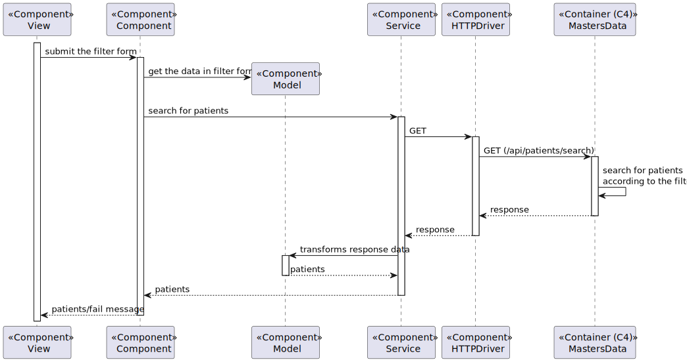

# US 6.2.9 - As an Admin, I want to list/search patient profiles by different attributes

## 1. Context

This US creates the functionality to list or search patient profiles by different attributes

## 2. Requirements

**6.2.9** As an Admin, I want to list/search patient profiles by different attributes, so that I can view the details, edit, and remove patient profiles.

### 2.1. Acceptance Criteria

- Admins can search patient profiles by various attributes, including name, email, date of birth, or medical record number.
- The system displays search results in a list view with key patient information (name, email, date of birth).
- Admins can select a profile from the list to view, edit, or delete the patient record.
- The search results are paginated, and filters are available to refine the search results.

### 2.2. User Story Dependencies

N/A

## 3. Analysis

Admins can search patients profiles by the following fields:
- Name
- Email
- Date Of Birth
- Medical Record Number

The system will display search result in view with key information: Medical Record Number, Full Name, Email and Date of birth

Afterwards, the admins can select one of the patients to view, edit or delete the patient profile.

Filters are avaiable to refine the search results

### 3.1. Client-relevant questions

**Q:** What types of filters can be applied when searching for profiles?

**R:** Filters can include doctor specialization, name, or email to refine search results.

### 3.2. Domain model references

N/A

## 4. Design - Process View

#### Level 1

#### Level 2

#### Level 3
