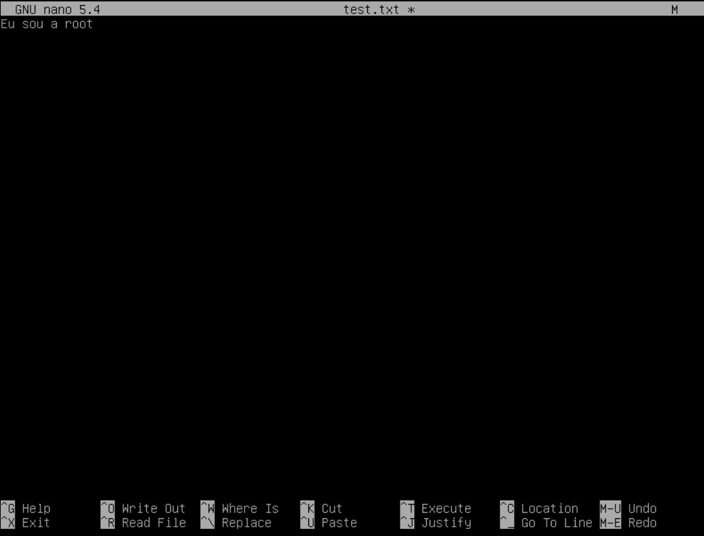
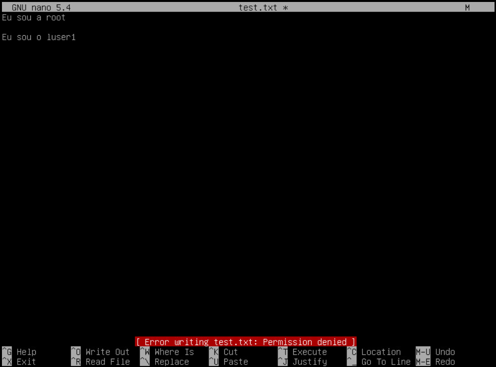

# US 6.4.7 - As system administrator I want to define a public folder for all users registered on the system, where they can read whatever is placed there.

As a System Administrator, the objective of this User Story is to define a public folder accessible to all registered users on the system, allowing them to read the content placed there.

## 1. Creating the Public Folder

A folder named "public" was created on the Linux system with the following command:

```bash
mkdir /public
```

To make the folder publicly accessible, the directory permissions need to be modified. This can be done with the following command:

```bash
chmod 755 /public
```

This command applies the following permissions (represented in octal format):

- 7 (read, write, and execute) for the directory owner (in this case, root)
- 5 (read and execute) for groups and system users

When permissions are assigned to the directory, the files and/or folders within it will inherit the permissions of the main directory.

## 2. Adding a file to the Folder

A file was added to the public folder with the following commands:

```bash
cd /public
nano test.txt
```

Content was written in the created file and then saved.



## 3. Testing Read-Only Access for Users

A session was started with a non-administrator user on the system (in this case, “luser1”). The user successfully accessed the public folder and was able to open the file within it. Upon opening the file, an attempt was made to modify its content, resulting in the following error:



This error confirmed that the previously assigned permissions on the folder are working as intended, as stated before. The user can only read the content within files/folders in the public folder.

Creating a public folder where all users can read the content is important for the security of the folder, as it allows general access to all users, but they cannot modify what is present in the directory.