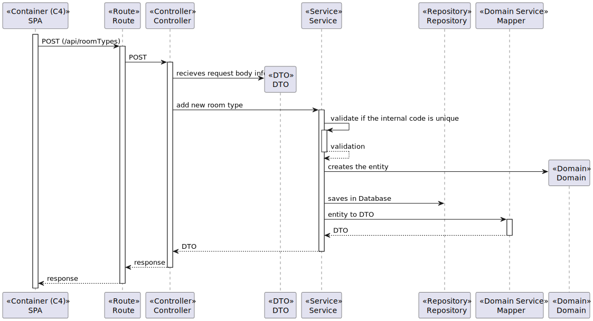

# US 7.2.10 - As an Admin, I want to add new Types of rooms.

## 1. Context

This US creates the functionality to add new types of rooms

## 2. Requirements

**7.2.10** As an Admin, I want to add new Types of rooms, so that I can reflect on the available medical procedures in the system.

### 2.1. Acceptance Criteria

N/A

### 2.2. User Story Dependencies

N/A

## 3. Analysis

The admin will input the name of the type of room to add in the system.

The room type is composed by:

- Internal Code
- Designation
- Description (this field is optional)
- Sultability for surgeries (Yes or No)

The designation of the room type must be unique on the system.

The room type will be a category to select the room when create a operation room in the system.

## 4. Design

### 4.1. Level 1

### 4.2. Level 2

### 4.3. Level 3

#### 4.3.1. Masters Data

#### 4.3.2. SPA

### 4.4. Architeture used

- **Onion**: The Onion Architecture emphasizes a clear separation of concerns by organizing code into concentric layers, with the core domain at the center and external dependencies on the outer layers.

### 4.5. Patterns used

#### 4.5.1. Masters Data

- **Repository Pattern**: Used to abstract the data access layer, providing a collection-like interface for accessing domain objects.
- **Unit of Work Pattern**: Maintains a list of objects affected by a business transaction and coordinates the writing out of changes.
- **DTO (Data Transfer Object) Pattern**: Used to transfer data between software application subsystems.

#### 4.5.2. SPA

- **MVVM (Model-View-ViewModel) Pattern**: Separates the development of the graphical user interface from the business logic or back-end logic.
- **Service Pattern**: Encapsulates the business logic, making it reusable and easier to test.
- **Repository Pattern**: Used to manage data operations and abstract the data access logic.

## 5. Tests Plan

### 5.1. Unit Tests

- **Test 1**: Verify that a new room type can be added successfully.
- **Test 2**: Ensure that adding a room type with a duplicate name is not allowed.
- **Test 3**: Validate that the room type name is stored correctly in the database.
- **Test 4**: Check that the system returns an appropriate error message when trying to add a room type with an invalid name (e.g., empty or null).

### 5.2. Integration Tests

- **Test 1**: Verify that the room type addition integrates correctly with the database.
- **Test 2**: Ensure that the new room type is available for selection when creating an operation room.
- **Test 3**: Validate that the system handles concurrent requests to add room types without data corruption.

### 5.3. End-to-End Tests

- **Test 1**: Simulate the admin adding a new room type through the user interface and verify that it appears in the list of available room types.
- **Test 2**: Ensure that the admin cannot add a room type with a duplicate name through the user interface.
- **Test 3**: Validate that the error messages are displayed correctly in the user interface when invalid data is entered.