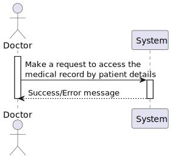
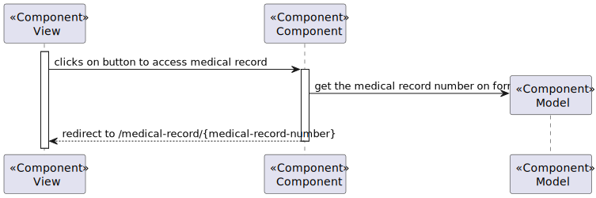

# US 7.2.14 - As a Doctor, I want to include the access of the Patient Medical Record during the patient profile visualization and management.

## 1. Context

This US creates the functionality to include the access of the Patient Medical Record during the patient profile visualization

## 2. Requirements

**7.2.14** As a Doctor, I want to include the access of the Patient Medical Record during the patient profile visualization and management, so that I manage it in that context.

### 2.1. Acceptance Criteria

N/A

### 2.2. User Story Dependencies

**US 6.2.6** - The patient profile must be created on the system

## 3. Analysis

When access the details of the patient profile, will exists a button to access the medical record of the patient.

When clicked the button, the system will appear the menu of manage the patient record.

## 4. Design

### 4.1. Level 1

### 4.2. Level 3

#### 4.2.1. SPA

### 4.3. Architeture used

- **Onion**: The Onion Architecture emphasizes a clear separation of concerns by organizing code into concentric layers, with the core domain at the center and external dependencies on the outer layers.

### 4.5. Patterns used

#### 4.5.1. SPA

- **MVVM (Model-View-ViewModel) Pattern**: Separates the development of the graphical user interface from the business logic or back-end logic.
