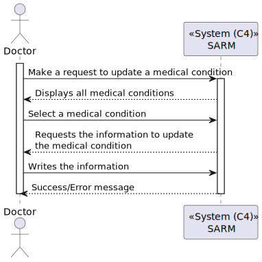
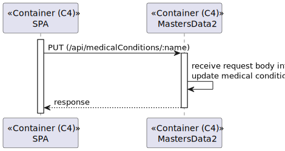
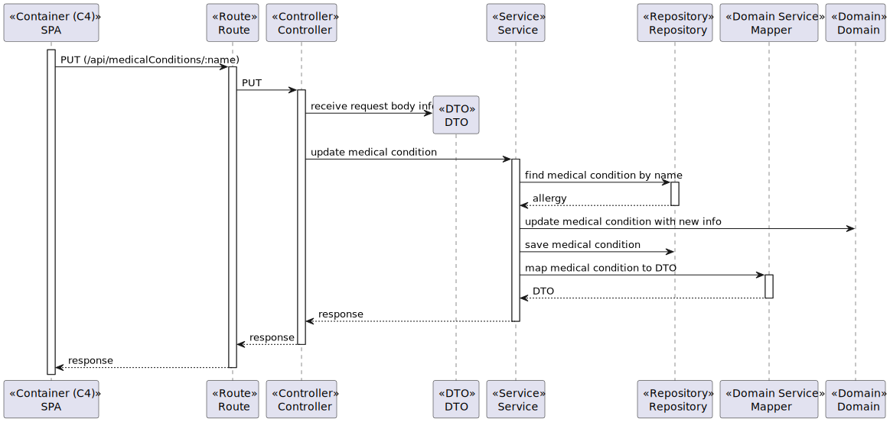
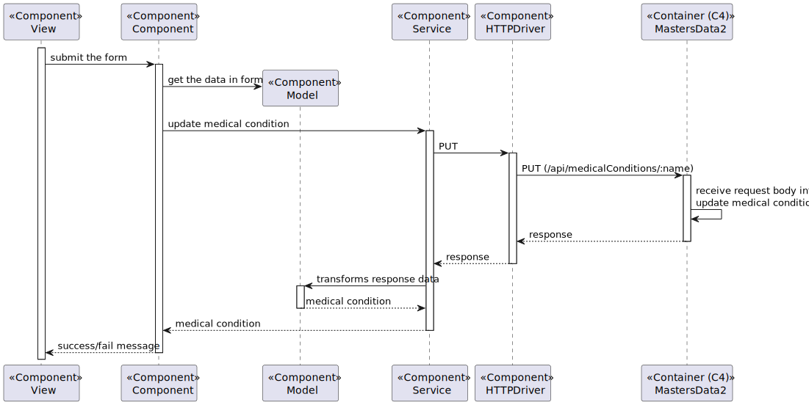

# US 7.2.17 - As a Admin, I want to update a medical condition.

## 1. Context

This US creates the functionality to edit a medical condition from catalog.

## 2. Requirements

**7.2.16** As a Admin, I want to update a medical condition.

### 2.1. Acceptance Criteria

N/A

### 2.2. User Story Dependencies

**7.2.4** The medical condition must be added on the system.

## 3. Analysis

The admin can edit the following fields from the medical condition:
- Name/Designation

The medical condition should still in the catalog but when edited, a new object will be created.

## 4. Design

### 4.1. Level 1

### 4.2. Level 2

### 4.3. Level 3

#### 4.3.1. Masters Data

#### 4.3.2. SPA

### 4.4. Architeture used

- **Onion**: The Onion Architecture emphasizes a clear separation of concerns by organizing code into concentric layers, with the core domain at the center and external dependencies on the outer layers.

### 4.5. Patterns used

#### 4.5.1. Masters Data 2

- **Repository Pattern**: Used to abstract the data access layer, providing a collection-like interface for accessing domain objects.
- **Unit of Work Pattern**: Maintains a list of objects affected by a business transaction and coordinates the writing out of changes.
- **DTO (Data Transfer Object) Pattern**: Used to transfer data between software application subsystems.

#### 4.5.2. SPA

- **MVVM (Model-View-ViewModel) Pattern**: Separates the development of the graphical user interface from the business logic or back-end logic.
- **Service Pattern**: Encapsulates the business logic, making it reusable and easier to test.
- **Repository Pattern**: Used to manage data operations and abstract the data access logic.

## 5. Tests Plan

### 5.1. Unit Tests

- **Test 1**: Verify that the system can update the name/designation of a medical condition.
- **Test 2**: Verify that the system creates a new object when a medical condition is edited.
- **Test 3**: Verify that the original medical condition remains in the catalog after editing.

### 5.2. Integration Tests

- **Test 1**: Verify that the update functionality integrates correctly with the database and updates the medical condition information.
- **Test 2**: Verify that the system correctly integrates with the user interface to display the updated medical condition information.

### 5.3. End-to-End Tests

- **Test 1**: Verify that an admin can successfully update a medical condition and view the updated information in the catalog.
- **Test 2**: Verify that the system creates a new object for the edited medical condition and retains the original medical condition in the catalog.