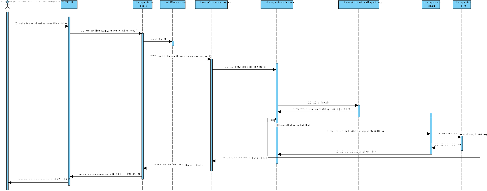

# US 7.2.3 - As a Doctor, I want to search for Allergies, so that I can use it to update the Patient Medical Record

## 1. Context

This User Story enables the functionality for searching allergies, allowing the doctor to use the information to update the patient's medical record.

---

## 2. Requirements

**7.2.3** As a Doctor, I want to search for Allergies, so that I can use it to update the Patient Medical Record.

### 2.1 User Story Dependencies

This User Story has the following dependencies:
- Patient medical records must be accessible to the doctor.
- Medical condition and allergy data must be available in the system.
- The allergy data must be structured to facilitate search and retrieval.

---

## 3. Analysis

The doctor should be able to:
- Search for allergies by the patient's ID or name.
- View detailed information about the allergies, such as severity, description, and possible reactions.
- Select and update the patient’s medical record with the allergy data.
- Add new allergies to the record if necessary.
- Edit existing allergies to ensure accurate and up-to-date information.
- Ensure that duplicate allergy entries are prevented.

---

## 4. Design - Process View

### Level 3

---

## 5. Applied Patterns

- **GRASP Pattern:** Assigns responsibility for allergy data search and updates to controller classes.
- **CRUD Pattern:** The system supports the basic operations for allergies—search, read, update, and delete.
- **SOLID Principles:**
  - **Single Responsibility Principle:** Allergy data management is handled by dedicated components.
  - **Open-Closed Principle:** The search and update system can be extended to support new allergy-related features.
  - **Liskov Substitution Principle:** Ensures derived allergy data types are compatible with the base functionality.
  - **Interface Segregation Principle:** Defines focused interfaces for allergy-related operations.
  - **Dependency Inversion Principle:** High-level components interact with abstract interfaces rather than concrete classes.
- **DTO Pattern:** Used to transfer allergy data without business logic.

---

## 6. Observations

- The search functionality should include auto-complete and filters to help doctors find relevant allergy information quickly.
- The system should support adding new allergies if they do not already exist in the system.
- Alerts should be triggered for severe allergies or reactions that are added or updated in the patient’s record.
