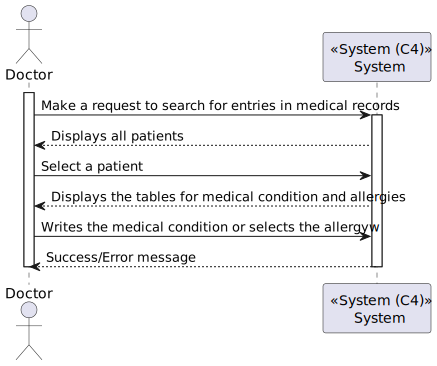
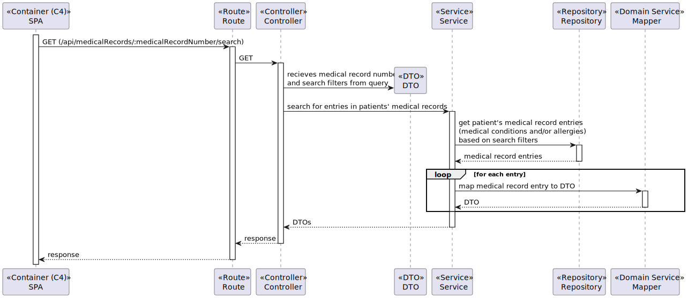
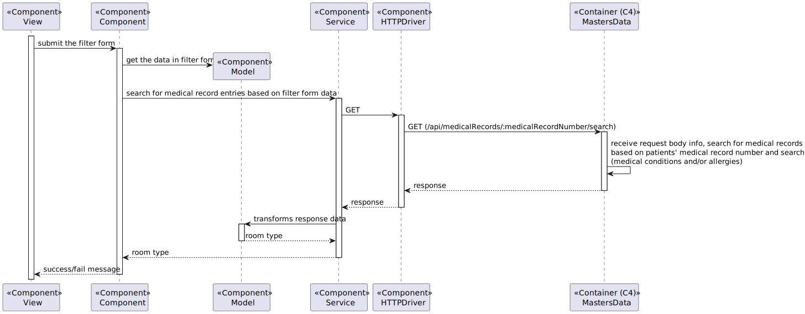

# US 7.2.7 - As a Doctor, I want to search for entries in the Patient Medical Record.

## 1. Context

This US creates the functionality to search for entries in the Patient Medical Record.

## 2. Requirements

**7.2.7** As a Doctor, I want to search for entries in the Patient Medical Record, namely
respecting Medical Conditions and Allergies.

### 2.1. Acceptance Criteria

N/A

### 2.2. User Story Dependencies

N/A

## 3. Analysis

The system first will search the medical record by his patient ID (medical record number)

The system will display two tables, one for allergies and other for medical conditions, and the doctor will search for each based on his name (in case of allergy, his cataloged name).

The results are filtered.

## 4. Design

### 4.1. Level 1

### 4.2. Level 2

### 4.3. Level 3

#### 4.3.1. Masters Data

#### 4.3.2. SPA

### 4.4. Architeture used

- **Onion**: The Onion Architecture emphasizes a clear separation of concerns by organizing code into concentric layers, with the core domain at the center and external dependencies on the outer layers.

### 4.5. Patterns used

#### 4.5.1. Masters Data 2

- **Repository Pattern**: Used to abstract the data access layer, providing a collection-like interface for accessing domain objects.
- **Unit of Work Pattern**: Maintains a list of objects affected by a business transaction and coordinates the writing out of changes.
- **DTO (Data Transfer Object) Pattern**: Used to transfer data between software application subsystems.

#### 4.5.2. SPA

- **MVVM (Model-View-ViewModel) Pattern**: Separates the development of the graphical user interface from the business logic or back-end logic.
- **Service Pattern**: Encapsulates the business logic, making it reusable and easier to test.
- **Repository Pattern**: Used to manage data operations and abstract the data access logic.
