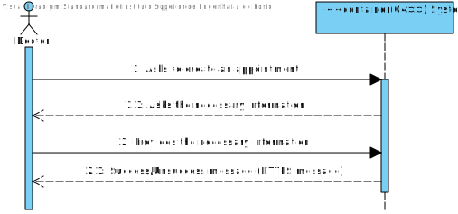
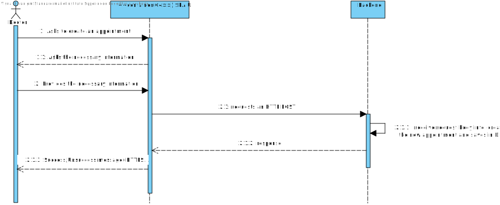

# US 7.2.8 - As a Doctor, I want to create a Surgery Appointment, so that the Patient doesn’t need to wait for the automatically generated planning.

## 1. Analysis

#### Functional requirements

*The doctor will be able to create an appointment, by schedulling it and choosing the team who will operate. 
*The doctor can search for and select a staff members to participate in the operation in order to create the appointment.

#### Business rules

*The doctor should be able to create an appointment, by schedulling it and choosing the team who will operate.
*There is a need to check occupations(rooms and staff members), to make sure the appointment can be executed.

#### Interested parts

*The interested parts in this US are the dorctor responsible, staff members that will operate and the patient that will go under surgery.

#### Preconditions

*Only the doctor responsible can create an appointment for one of his requests.
*The doctor responsible must be logged in.

#### Postconditions

*The data is updated in real-time across the system.

#### User Story Dependencies

*No dependencies

## Domain model apperance

## Level 1 - Process view:

# Design

 ## Level 2 - Process view
 

 ##  Applied Patterns

*GRASP Pattern (General Responsibility Assignment Software Patterns), used in the creation of controllers to assign the responsibility of handling system events to a class that is not part of the user interface (UI);

*CRUD Pattern (acronym for Create, Read, Update, and Delete) represents the four basic operations used in relational databases provided to system users, as well as in many HTTP services;

*SOLID Pattern (acronym for Single Responsibility Principle, Open-Closed Principle, Liskov Substitution Principle, Interface Segregation Principle, Dependency Inversion Principle), a set of principles that apply to any object-oriented design and serve as the central philosophy for methodologies like adaptive software development;

*DTO Pattern (Data Transfer Objects), for creating simple data structures that do not contain business logic.

# Implementation

 ## Level 3 -Process view
 

# Observations

 