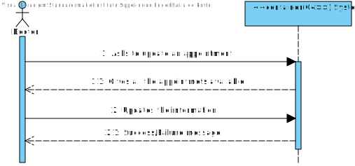
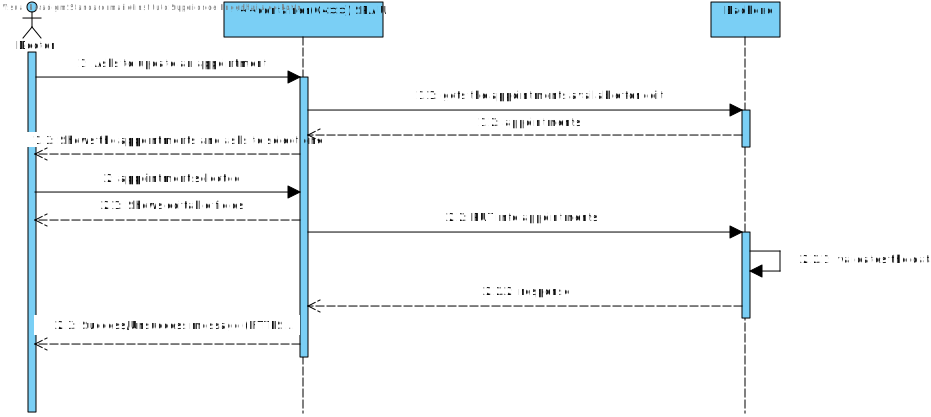
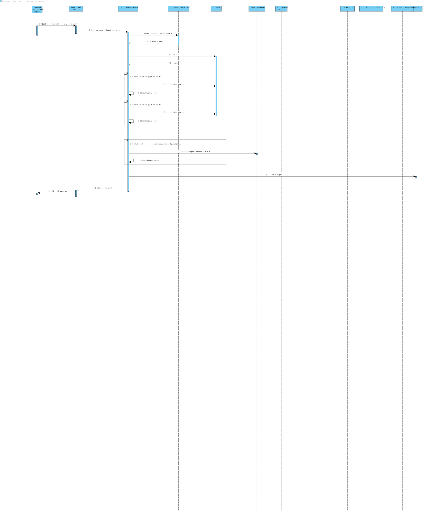

# US 7.2.9 - As a Doctor, I want to update a Surgery Appointment, so that I can override the automatically generated planning.

---

## 1. Analysis

### Functional Requirements

- The doctor can search for and select an appointment to update.
- The doctor can override the system's automated planning by rescheduling the appointment or modifying the assigned team and room.
- Editable fields include:
  - Appointment Date
  - Team assigned to the operation
  - Operation Room
  - Operation Request details
- Real-time updates ensure that changes are reflected across the system.
- Occupation checks must validate the availability of staff and rooms before confirming the update.

---

### Business Rules

- The doctor must have the authority to update only the appointments they are responsible for.
- Validation checks must ensure no conflicts in schedule for the updated date, room, and staff.
- Overrides should log a history of changes for auditing purposes.

---

### Interested Parties

- The doctor responsible for managing the appointment.
- Staff members assigned to the operation.
- The patient scheduled for surgery.
- Administration staff who may monitor schedule conflicts or logs.

---

### Preconditions

- The doctor must be authenticated and logged into the system.
- The appointment must exist and belong to the logged-in doctor.
- The appointment must be modifiable (i.e., not locked due to proximity to the surgery date or other restrictions).

---

### Postconditions

- The updated data is applied in real-time and available throughout the system.
- The system logs the changes, capturing the previous and updated values for audit purposes.

---

### User Story Dependencies

- **US 7.1.8:** Appointments must exist before they can be updated.
- **US 7.3.1:** To ensure team and room availability, occupation and conflict checks rely on system data from this user story.

---

## 2. Design

### Level 1 

---

### Level 2 

---

### Level 3

## 3. Implementation

### Applied Patterns

- **GRASP Pattern:** Used to delegate system events to non-UI controller classes for better separation of concerns.
- **CRUD Pattern:** Allows efficient management of appointments in the database, enabling update operations.
- **SOLID Principles:**
  - **Single Responsibility Principle:** Ensures each class handles only its assigned responsibilities.
  - **Open-Closed Principle:** Classes can be extended to handle new update logic without altering existing code.
  - **Liskov Substitution Principle:** Guarantees interchangeable use of derived classes.
  - **Interface Segregation Principle:** Ensures interfaces are focused and specific.
  - **Dependency Inversion Principle:** Decouples high-level and low-level modules.
- **DTO Pattern:** Facilitates data transport between layers without embedding business logic.

---

## Observations

- Overrides should include a justification field to document why the automatic planning was adjusted.
- Notifications should be sent to affected parties (e.g., staff, patient) after the update.
- Changes should be reversible under specific conditions to account for errors or emergencies.