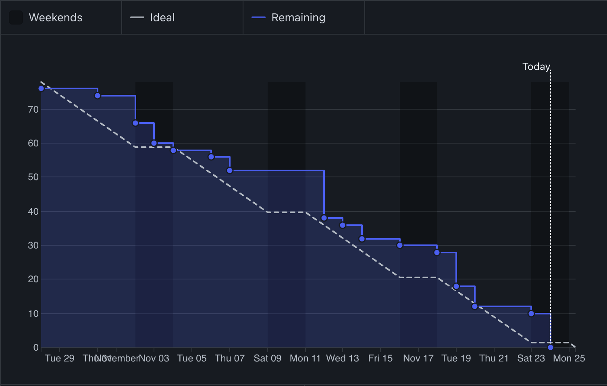

# Reflexão sobre o Gráfico de Burndown

## Visão Geral

O gráfico de burndown acima fornece uma representação visual clara do progresso do projeto ao longo do tempo. Ele destaca como as tarefas estão a ser concluídas em comparação com a linha temporal esperada. O gráfico inclui dois elementos principais: 

1. **A Linha Ideal**: Representada por uma linha tracejada, indica o ritmo ideal para a conclusão das tarefas, assegurando que o projeto cumpra os prazos.
2. **A Linha de Trabalho Restante**: Representada por uma linha azul sólida, reflete o progresso real feito pela equipa.

## Análise do Gráfico de Burndown

- **Progresso Inicial**: Durante os primeiros dias, o progresso foi mais lento do que o esperado, com a linha de trabalho restante a manter-se acima da linha ideal. Isto pode indicar desafios iniciais como esclarecimento do projeto, configurações ou atrasos imprevistos.

- **Aceleração no Meio**: Na metade do período do projeto, uma aceleração visível na conclusão das tarefas é observada. A linha de trabalho restante aproxima-se da linha ideal, sugerindo que os bloqueios foram resolvidos e que a equipa tornou-se mais eficiente.

- **Fechamento Estável**: No final, o ritmo alinha-se mais estreitamente com a linha ideal, indicando que a equipa estabeleceu um ritmo para concluir as tarefas. Isto demonstra uma melhoria no foco e alinhamento com os objetivos da sprint.

## Principais Conclusões

1. **Ajustes Necessários**: Os atrasos na fase inicial devem ser analisados para evitar recorrências.
2. **A Importância do Momento**: A aceleração observada no meio do projeto demonstra que, uma vez resolvidos os bloqueios, a equipa consegue recuperar bem. 
3. **Impacto dos Fins de Semana**: As áreas sombreadas representando os fins de semana fornecem uma visão sobre os efeitos de períodos de inatividade. O planeamento deve considerar os dias não úteis para manter a linha ideal realista.

## Áreas para Melhorar

- **Planeamento Proativo**: Esforços para alinhar o progresso inicial com a linha ideal podem minimizar os atrasos iniciais. Isto pode incluir uma decomposição detalhada das tarefas e uma gestão eficaz de dependências.
- **Manutenção do Momentum**: Manter o forte ritmo observado na fase intermédia pode ajudar a fechar as lacunas entre as linhas real e ideal de forma mais eficaz.

## Conclusão

No geral, o gráfico de burndown reflete um projeto bem gerido, com alguns atrasos iniciais que foram eficazmente mitigados nas fases seguintes. A equipa demonstrou resiliência e eficiência ao recuperar e alinhar-se com o cronograma. Ao abordar os desafios da fase inicial e sustentar o momentum, projetos futuros podem ser executados de forma ainda mais eficaz.