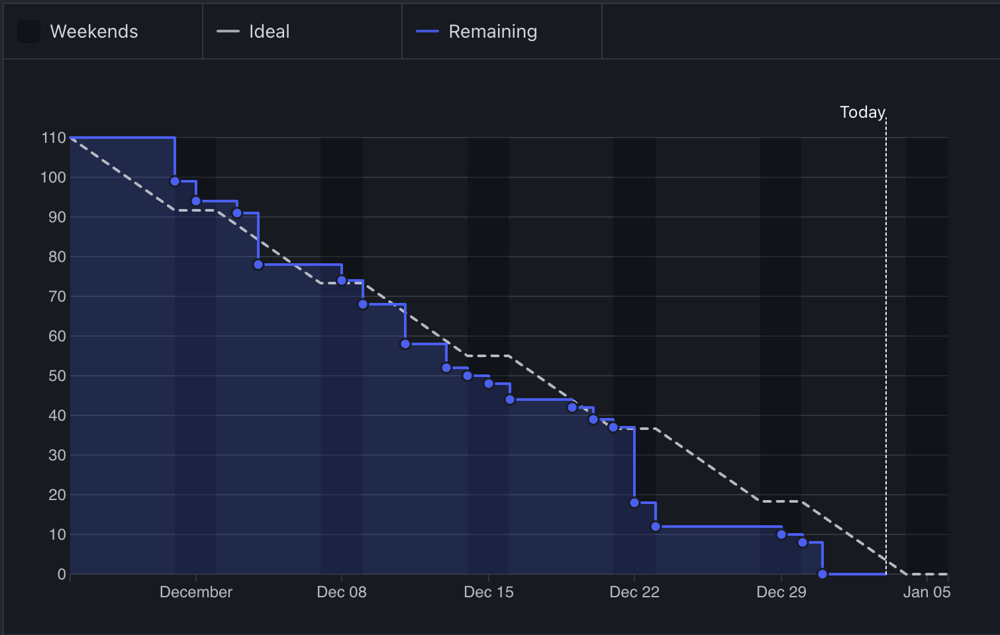

# Reflexão sobre o Gráfico de Burndown

## Gráfico de Burndown

### Visão Geral
O gráfico de burndown apresentado oferece uma visão visual abrangente sobre o progresso do sprint ou projeto ao longo do tempo. Ele mostra, de forma clara, como a equipa está a lidar com as tarefas planeadas em relação à linha temporal ideal. O gráfico é composto por dois elementos principais:

1. **A Linha Ideal**: Representada por uma linha tracejada, esta linha reflete o ritmo constante necessário para concluir todas as tarefas dentro do prazo estipulado.  
2. **A Linha de Trabalho Restante**: Representada por uma linha azul sólida, ilustra o progresso real feito pela equipa ao longo do sprint, permitindo comparações diretas com o planeado.

---

### Análise do Gráfico de Burndown

#### **Progresso Inicial**
Nos primeiros dias do sprint, observa-se que o progresso foi mais lento do que o esperado. A linha de trabalho restante encontra-se acima da linha ideal, sugerindo possíveis dificuldades iniciais, como falta de clareza nos objetivos, bloqueios técnicos ou atrasos na configuração inicial do projeto.

#### **Aceleração no Meio**
Na fase intermédia do sprint, nota-se uma aceleração no ritmo de conclusão das tarefas. A linha de trabalho restante aproxima-se da linha ideal, indicando que a equipa conseguiu superar os bloqueios iniciais e estabilizar os esforços para atingir os objetivos definidos.

#### **Conclusão Antecipada**
Nos últimos dias do sprint, conseguimos manter o progresso alinhado com a linha ideal, o que refletiu um foco renovado da equipa e um bom ritmo de trabalho. Conseguimos concluir as tarefas pendentes com antecedência e alcançar os resultados esperados.

---

### Principais Conclusões

1. **Ajustes Necessários**: Os atrasos iniciais precisam de ser analisados para identificar e mitigar as causas, garantindo que não se repitam em sprints futuros.
2. **Resiliência da Equipa**: A aceleração observada no meio do sprint demonstra a capacidade da equipa de se adaptar e recuperar o atraso.
3. **Impacto dos Dias Não Úteis**: Os fins de semana representados no gráfico indicam períodos de inatividade que afetam o progresso. É essencial incorporar esses períodos no planeamento.

---

### Áreas para Melhorar

- **Planeamento Proativo**: Realizar uma decomposição detalhada das tarefas antes do início do sprint, antecipando possíveis dependências e desafios.
- **Manutenção do Ritmo**: Identificar estratégias para sustentar o forte ritmo alcançado na fase intermédia do sprint, como reuniões regulares de acompanhamento e revisões de progresso.

---

### Conclusão
O gráfico de burndown reflecte um projeto bem gerido, apesar de atrasos iniciais que foram mitigados de forma eficaz nas fases subsequentes. A equipa demonstrou resiliência e capacidade de adaptação, conseguindo alinhar-se com os objetivos definidos. Com melhorias no planeamento inicial e na manutenção do ritmo, sprints futuros poderão ser ainda mais eficientes e produtivos.